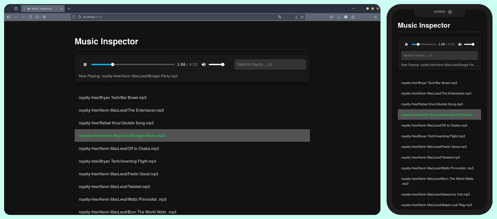

#  Music Inspector

A lightweight web UI to inspect and play the latest song additions to a
directory.

This tool is ideal for checking on a folder of incoming music, such as a
downloads directory used by a peer-to-peer client like
[slskd](https://github.com/slskd/slskd). It recursively scans a folder, lists
all tracks with the most recently added ones first, and allows for quick
playback and searching.



## Features

- **Recursive File Discovery:** Scans the entire directory tree to find all
  audio files.
- **Recency-First Sorting:** Automatically lists files from most to least
  recently modified, making it easy to see new additions.
- **Instant Search:** Quickly filter the list by file path to find specific
  tracks.
- **Simple Playback:** Click any track to play it instantly in the browser.
- **Secure and Containerized:** Runs as a minimal, secure, distroless Docker
  container.

## Usage

This software can be run either with Docker, Podman or natively with Node.js.

### Method 1: Docker Compose (Recommended)

This is the simplest way to run the application.

First, create a `./build/` directory and clone this repository inside

```bash
git clone https://github.com/Fran314/music-inspector.git ./build/.
```

Use the following `compose.yaml` as a template:

```yaml
# compose.yaml
services:
    music-inspector:
        build: ./build
        container_name: music-inspector
        restart: unless-stopped
        ports:
            - '8292:8292'
        environment:
            - PORT=8292
            - MUSIC_DIR=/app/music
        volumes:
            - ./music:/app/music:ro
```

From the project's root directory, build and run the container:

```bash
docker compose up --build -d
```

### Method 2: Podman

You can also use native Podman commands to build and run the application.

First, create a `./build/` directory and clone this repository inside

```bash
git clone https://github.com/Fran314/music-inspector.git ./build/.
```

Then:

1.  **Build the image:**

    ```bash
    podman build -t music-inspector ./build
    ```

2.  **Run the container:**
    ```bash
    podman run --rm -d \
      --name music-inspector \
      -p 8292:8292 \
      --env PORT=8292 \
      --env MUSIC_DIR=/app/music \
      -v ./music:/app/music:ro,Z \
      music-inspector
    ```
    _Note: The `:Z` flag on the volume mount is necessary for proper permissions
    on SELinux-enabled systems._

### Method 3: Node.js

Of course you can also just clone the repo, install the depenencies and run it
as is

```bash
git clone https://github.com/Fran314/music-inspector.git .
npm install
PORT=[YOUR_PORT] MUSIC_DIR="path/to/music/dir" npm start
```
